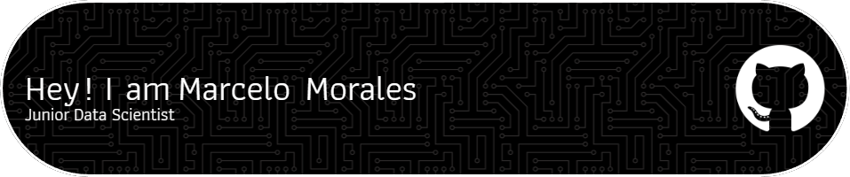

I'm a **passionate developer** with experience in **Python and Java** and currently working on exciting projects like **Service Cancellation Prediction**.

---

## 🚀 About Me  

- 🎓 Currently studying at **Facultad de Sistemas UAdeC**.  
- 💻 Skilled in **Python, Java, 3D Modeling/Sculpting, and SQL**.  
- 🌱 Currently learning **Web Development**.  
- ✨ Enthusiast of **Music**, **Cinema**, and **Web Development**.  
- 🌎 Location: **Mexico**.  

---

## 🌟 Technical Skills  

### Programming Languages  

### Tools and Frameworks  

### Other  

---

## 🛠️ Featured Projects  

### 📊 [INEGI Census Project](https://github.com/dedguyseis/INEGI)  
A census management tool built using Java, MVC, and MySQL. It features CRUD operations, executive dashboards, and statistical reporting functionalities to analyze population data.

### 🛒 [Sales Management System](https://github.com/your-repo)  
A web-based application designed for small businesses, offering capabilities for tracking sales, managing inventory, and generating data-driven analytics.  

### 🌍 [Customer Churn Predictor](https://github.com/your-repo)  
A machine learning project focused on predicting customer churn in the banking sector, optimized for F1-score and AUC-ROC metrics.  

---

## 🎯 My Goals  

- 🚀 Expand my expertise in **DevOps** and **Big Data**.  
- 🤝 Collaborate on **projects with global impact**.  
- 💡 Learn new technologies like **Artificial Intelligence** and **Blockchain**.  

---

## 🌐 Find Me Here:  

-   
-   
- 📧 Email: **mm131018@hotmail.com**  

---

_✨ Always open to learning, collaborating, and creating something amazing._  
